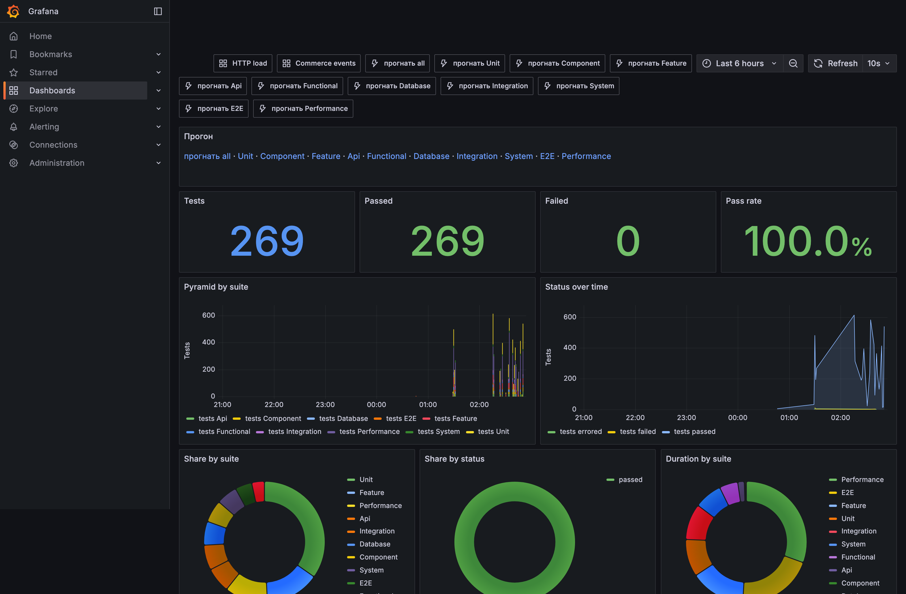
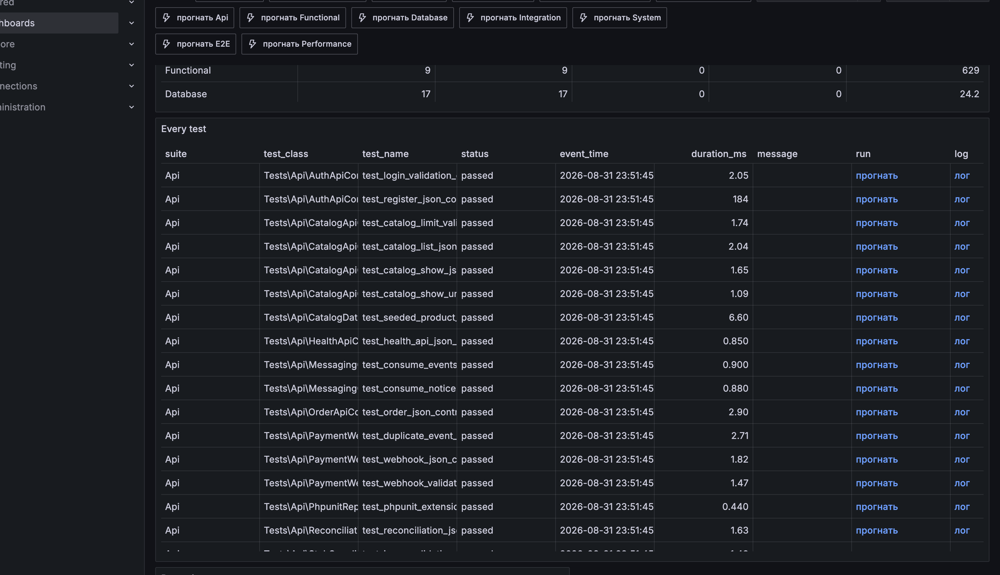

# Магазин цифровых кодов

Серверная часть магазина цифровых кодов. Покупатель создаёт заказ. Оплата приходит отдельным уведомлением. Код выдаёт поставщик-заглушка. Лицо магазина в задании не требуется. Реального эквайринга тоже нет.

Главное в ТЗ: код уходит один раз. Гонки не плодят вторую выдачу. Если ожидание у поставщика вышло, это ещё не отказ. Зависший заказ можно поднять тем же идентификатором запроса.

Результаты проверок доступны в Grafana: http://localhost:3000/d/phpunit-tests, вход admin / admin. На дашборде собраны наборы, отдельные кейсы, прогон и лог. Гонки из ТЗ - набор **System**, строка **ExactlyOnceDeliveryTest**. Описание видов - в [Проверки](#проверки).





## Оглавление

1. [Стек](#стек)
2. [Как запустить](#как-запустить)
3. [Поток заказа](#поток-заказа)
4. [Этап 1. Ядро](#этап-1-ядро)
5. [Этап 2. Гонки](#этап-2-гонки)
6. [Этап 3. Поставщики](#этап-3-поставщики)
7. [Этап 4. Сверка и восстановление](#этап-4-сверка-и-восстановление)
8. [Этап 5. Витрина](#этап-5-витрина)
9. [Как масштабировали бы](#как-масштабировали-бы)
10. [Redis](#redis)
11. [Kafka](#kafka)
12. [RabbitMQ](#rabbitmq)
13. [Проверки](#проверки)
14. [CI/CD](#cicd)
15. [API](#api)

## Стек

- PHP 8.3 и Laravel 13
- PostgreSQL 16 как основная база
- Redis 7: очередь, сессии, временное хранение витрины
- Nginx слушает 80 порт и передаёт запросы в php-fpm
- отдельный контейнер крутит очередь
- отдельный контейнер крутит расписание
- RabbitMQ несёт служебные извещения
- Kafka несёт журнал событий заказа
- ClickHouse принимает логи
- Grafana на порту 3000: логи и дашборд проверок http://localhost:3000/d/phpunit-tests
- доступ к заказам по ключу (Sanctum)

Код лежит в apps/api. Контейнеры описаны в корневом docker-compose.yml. Образы и конфиги служб в infra/docker.

```
клиент
  nginx :80
    php-fpm
      postgres
      redis          очередь и витрина
      kafka          журнал событий
      rabbitmq       извещения
      clickhouse     логи
        grafana :3000

очередь и планировщик ходят в postgres и redis отдельно от php-fpm
```

## Как запустить

Из корня репозитория.

```bash
cp .env.example .env
docker compose up -d
docker compose exec php php artisan key:generate
docker compose exec php php artisan migrate --force
docker compose exec php php artisan db:seed
```

После наполнения базы вход test@example.com / password. Каталог: 12 товаров из ТЗ плюс большая витрина для нагрузки. Пул ключей тоже из задания.

Магазин слушает порт 80. Дашборд проверок: Grafana http://localhost:3000/d/phpunit-tests, вход admin / admin. Вверху панель "Прогон" и те же ссылки справа у заголовка. В таблице Every test колонки "прогнать" и "лог" на каждый кейс. Ниже - Run suites. Ссылка открывает вывод PHPUnit текстом в новой вкладке.

## Поток заказа

В ТЗ заказ идёт created, затем paid, затем delivering, затем delivered. Отказ оплаты конечный. Пустой склад и сбой выдачи можно чинить без второго кода.

```
created
  paid
    delivering
      delivered
      out_of_stock      снова delivering после пополнения
      delivery_failed   снова delivering после повтора
  payment_failed
```

## Этап 1. Ядро

ТЗ просит три вещи: создать заказ по артикулу, прочитать его, принять оплату. После paid ключ должен уйти сам. Пустой пул даёт out_of_stock, а не падение.

Контроллер только проверяет вход, зовёт службу и отдаёт ответ. Счёт денег и статусов здесь нет. Иначе гонки и выдача расползутся по слою запросов.

```php
public function store(CreateOrderRequest $request, OrderServiceInterface $orders): JsonResponse
{
    $order = $orders->create($this->authenticatedUser($request), $request->string('sku')->toString());

    return response()->json(OrderData::fromModel($order)->toArray(), 201);
}
```

Файл: apps/api/app/Http/Controllers/OrderController.php.

Уведомление об оплате в PDF выглядит так: event_id, order_id, status (paid или failed), сумма, валюта, время. Ответ быстрый. Подпись не проверяем. Путь у нас /api/webhook/payment, потому что все маршруты сидят под префиксом /api.

```php
$webhooks->handle($request->validated());

return response()->json(['accepted' => true]);
```

Файл: apps/api/app/Http/Controllers/PaymentWebhookController.php.

В ТЗ оплата может прийти раньше заказа. Служба заказа после создания доигрывает отложенные события. Иначе сценарий "уведомление не по порядку" ломается.

```php
$order = Order::query()->create([
    'user_id' => $user->id,
    'product_id' => $product->id,
    'sku' => $product->sku,
    'amount' => $product->price,
    'currency' => $product->currency,
    'status' => OrderStatus::Created,
]);

$this->paymentWebhookService->applyPendingForOrder($order);
```

Файл: apps/api/app/Services/Orders/OrderService.php.

## Этап 2. Гонки

Обязательный кусок ТЗ. Пятьдесят параллельных paid на один заказ дают ровно одну выдачу. Повтор с тем же event_id ничего не меняет. Все ответы 200.

Защита в три слоя, как в задании.

Первый слой: уникальный event_id. Второй такой же вставки нет. Берём уже лежащую строку.

```php
try {
    return $this->insert($eventId, $payload);
} catch (UniqueConstraintViolationException) {
    return $this->existing($eventId);
}
```

Файл: apps/api/app/Services/Payments/PaymentEventStore.php.

В таблице это же правило стоит железом: event_id уникален. То же на deliveries.request_id и на product_keys.order_id. Даже если служба ошибётся, база не отдаст два ключа одному заказу и не заведёт две выдачи.

Второй слой: локер Laravel, не свой mutex и не Cache::lock в Redis. Это Eloquent\Builder::lockForUpdate(): в той же транзакции PostgreSQL строка события и заказа берутся SELECT ... FOR UPDATE. Пока первая нитка держит строку, вторая ждёт и видит уже обработанное событие.

```php
$lockedEvent = PaymentEvent::query()->lockForUpdate()->find($event->id);

if ($lockedEvent === null || $lockedEvent->processed_at !== null) {
    return;
}

$order = Order::query()->lockForUpdate()->find($lockedEvent->order_id);
```

Файл: apps/api/app/Services/Payments/PaymentWebhookService.php.

Третий слой: ключ забирается атомарно. В PostgreSQL стоит for update skip locked, чтобы параллельные заказы не стояли в очереди на одну и ту же строку пула.

```php
if (DB::connection()->getDriverName() === 'pgsql') {
    $query->lock('for update skip locked');
}
```

Файл: apps/api/app/Services/Inventory/EloquentProductKeyInventory.php.

Проверка из ТЗ: пятьдесят тел с разными event_id бьют в один заказ. Потом в базе одна выдача и один проданный ключ. В Grafana http://localhost:3000/d/phpunit-tests это набор **System**, строка **ExactlyOnceDeliveryTest**.

```php
for ($i = 0; $i < 50; $i++) {
    $payloads[] = PaymentWebhookPayload::paid($orderId, 'evt_race_'.$orderId.'_'.$i, $amount);
}

$codes = ParallelJson::post($checkout['base'].'/api/webhook/payment', $payloads);

$this->assertSame(1, LivePostgres::countKeysForOrder($orderId));
$this->assertSame(1, LivePostgres::countDeliveriesForOrder($orderId));
```

Файл: apps/api/tests/System/ExactlyOnceDeliveryTest.php.

```
50 уведомлений paid
  уникальный event_id
    блокировка заказа
      один ключ sold
      одна строка deliveries
```

## Этап 3. Поставщики

В ТЗ два поставщика-заглушки A и B. Повтор только с тем же request_id. Новый идентификатор только при смене поставщика. Если ожидание вышло, а код уже выдан, повтор не даёт второй код.

Сначала три попытки на A. Если A жив или склада нет, B не трогаем. Иначе B с суффиксом _b.

```php
$primary = $this->retry->run($this->primary, $requestId, $sku, $orderId);

if ($primary->isOk() || $primary->isOutOfStock()) {
    return $primary;
}

return $this->retry->run($this->secondary, $requestId.'_b', $sku, $orderId);
```

Файл: apps/api/app/Services/Suppliers/FallbackSupplier.php.

Почему _b, а не тот же request_id: в ТЗ смена поставщика получает новый идентификатор. Повтор на A должен попасть в ту же запись заглушки. Иначе A мог выдать код, ответ потерялся, B выдаст второй.

Заглушка помнит пару поставщик плюс request_id. Повтор читает старый код.

```php
$known = $this->issuer->find($name, $requestId);

if ($known !== null) {
    return SupplierIssueResult::ok($known)->attributed($name, $requestId);
}
```

Файл: apps/api/app/Services/Suppliers/DirectSupplierClient.php.

Режим hang как раз ловушка из ТЗ. Код уже лежит. Ответ клиенту приходит как истекшее ожидание. Следующий заход с тем же request_id отдаёт тот же код.

```php
if ($mode === SupplierMode::Hang && $result->isOk()) {
    return SupplierIssueResult::timeout()->attributed($name, $requestId);
}
```

Режимы задаются в .env: SUPPLIER_A_MODE и SUPPLIER_B_MODE. Значения ok, fail, hang.

Выдача к поставщику идёт вне блокировки заказа. Сначала короткая транзакция готовит попытку. Потом вызов. Потом вторая транзакция пишет итог. Иначе зависший поставщик держит строку заказа и глушит остальные уведомления.

```
поставщик A, тот же request_id
  успех или пустой склад    тот же код
  ошибка или ожидание вышло
    повтор A
      поставщик B, request_id_b    тот же код на заказе
```

## Этап 4. Сверка и восстановление

Нужны расхождения paid_not_delivered и delivered_not_paid, журнал проводок, подъём зависших paid и delivering.

Сверка смотрит заказы и журнал. Не отдельную "магическую" таблицу.

```php
return new ReconciliationReport(
    $this->summarize($this->paidNotDelivered()),
    $this->summarize($this->deliveredNotPaid()),
    $this->ledger->debit(),
    $this->ledger->credit(),
);
```

Файл: apps/api/app/Services/Reconciliation/ReconciliationService.php. Маршрут: GET /api/reconciliation.

Журнал пишет пару строк. Оплата: приход и обязательство выдать. Выдача: снятие обязательства и расход ключа. Повтор той же причины на заказ отсекается уникальным ключом.

```php
$this->postPair(
    $order,
    LedgerReason::PaymentReceived,
    LedgerReason::DeliveryLiability,
);
```

Файл: apps/api/app/Services/Ledger/LedgerWriter.php.

Зависшие заказы поднимает задание раз в минуту. Повтор идёт через recover(), а не через новую выдачу. Тот же request_id, те же уникальные ключи.

```php
Schedule::job(RecoverStuckOrdersJob::class)->everyMinute();
```

Файл: apps/api/routes/console.php. Вручную: docker compose exec php php artisan commerce:recover-stuck.

Логи платежа и выдачи пишутся в ClickHouse. На графиках Grafana видны статусы и поставщик.

## Этап 5. Витрина

Горячий запрос: товары в наличии, сортировка по остатку. Остаток лежит на products.available_keys_count и меняется в той же транзакции, что продажа ключа.

Покрывающий индекс в PostgreSQL. Планировщик не ходит в кучу за именем и ценой.

```sql
CREATE INDEX IF NOT EXISTS products_storefront_in_stock_idx
ON products (available_keys_count DESC, sku)
INCLUDE (name, price, currency, type, image)
WHERE is_active AND available_keys_count > 0
```

Файл: apps/api/database/migrations/2026_08_31_190000_add_storefront_catalog_indexes.php.

Сам запрос витрины:

```sql
SELECT sku, name, price, currency, type, image, available_keys_count
FROM products
WHERE is_active = true AND available_keys_count > 0
ORDER BY available_keys_count DESC, sku
LIMIT 50
```

Проверка плана: apps/api/tests/Integration/StorefrontQueryPlanTest.php. Там EXPLAIN и запрет последовательного скана. Ожидается индекс products_storefront_in_stock_idx.

Список на десять секунд лежит в Redis. После продажи ключа запись сбрасывается. Иначе витрина врёт про остаток.

```php
public function inStock(int $limit): array
{
    return $this->cache->remember($limit, fn (): array => $this->inner->inStock($limit));
}
```

Файл: apps/api/app/Services/Catalog/CachedCatalogStorefront.php.

## Как масштабировали бы

Источник правды остаётся PostgreSQL: уникальные event_id, request_id, ключ на заказ. Брокеры и кэш нагрузку снимают, повторно выдавать код не имеют права.

Выдачу уже не держим под блокировкой заказа: короткая транзакция готовит попытку, вызов поставщика снаружи, вторая транзакция пишет итог. Под нагрузкой тот же приём усиливают очередью. Вебхук отвечает 200 и кладёт работу "выдать заказ N" в Redis-очередь Laravel. Воркеры забирают пачку. Повтор той же работы бьёт в те же уникальные ключи. Поставщик по-прежнему видит тот же request_id. Число воркеров крутят отдельно от php-fpm.

Заказы и события режут по order_id. Один заказ всегда на одном шарде и в одной партиции Kafka (ключ уже order_id). Гонки по пятидесяти paid остаются локальными. Сверку и журнал считают в ClickHouse или отдельным чтением, не на горячем шарде записи.

Витрина читает остаток чаще, чем продают ключ. Список кладут в Redis на десять секунд. Когда кэш не попал, SELECT остатков идёт на read-replica PostgreSQL. Продажа ключа и available_keys_count пишутся на primary в одной транзакции, затем epoch кэша сбрасывается. Реплика отстаёт на доли секунды, кэш это прячет. Покрывающий индекс на replica тот же, последовательного скана нет.

## Redis

Redis здесь не база заказа. Он держит то, что можно потерять и набрать заново.

Очередь Laravel (QUEUE_CONNECTION=redis): контейнер queue крутит RecoverStuckOrdersJob и прочую фоновую работу. Сессии (SESSION_DRIVER=redis). Общий кэш, в том числе витрина: ключ catalog:storefront:{epoch}:{limit}, жизнь 10 секунд. После продажи ключа epoch растёт, старый список больше не читают.

Второй контур: почтовый ящик шины. Консьюмеры Kafka и Rabbit кладут факты и извещения в списки commerce:events:inbox и commerce:notices, плюс последний факт заказа. Это хвост для отладки и health, не замена payment_events.

Логи прогона тестов из Grafana тоже лежат в Redis на короткое время: test:run:logs.

Файл кэша витрины: apps/api/app/Services/Catalog/StorefrontCache.php. Ящик шины: apps/api/app/Services/Messaging/RedisCommerceInbox.php.

## Kafka

Kafka несёт журнал фактов заказа. Тема commerce.events, ключ сообщения - order_id. Пишет FanOutCommerceLogger: сначала строка в ClickHouse, сразу следом факт в Kafka. Типичные события: оплата принята, оплата отклонена, код выдан.

Это не очередь выдачи и не блокировка гонки. Повтор event_id ловит PostgreSQL. Kafka нужна, чтобы другой сервис (аналитика, антифрод, витрина "что случилось с заказом") читал поток по заказу по порядку, не долбя основную базу. Консьюмер commerce:consume-events снимает пачку и кладёт хвост в Redis.

Файл шины: apps/api/app/Services/Messaging/KafkaCommerceEventBus.php. Вызов: apps/api/app/Services/Logging/FanOutCommerceLogger.php.

```
оплата / выдача
  ClickHouse   лог для Grafana
  Kafka        факт по order_id
    consume-events
      Redis inbox
```

## RabbitMQ

RabbitMQ несёт короткие служебные извещения, не журнал. Очередь commerce.notices. После смены статуса служба кладёт работу: payment_accepted, payment_failed, issued. Тело: order_id и вид.

Зачем отдельно от Kafka: факт "оплата прошла" пишут один раз и читают многие. Извещение "сходи, моргни письмом / обнови панель" нужно доставить воркеру и забыть. Rabbit это умеет: очередь, ack, повтор если воркер умер. Консьюмер commerce:consume-notices снимает извещение в Redis.

Выдача кода по-прежнему в транзакции PostgreSQL. Rabbit только говорит "уже выдано". Повтор извещения не создаёт второй ключ.

Файл очереди: apps/api/app/Services/Messaging/RabbitMqCommerceWorkQueue.php. Кладёт PaymentWebhookService и DeliveryService.

```
paid / failed / issued
  PostgreSQL     статус и ключ
  RabbitMQ       извещение
    consume-notices
      Redis notices
```

## Проверки

Из корня, пока контейнеры живы:

```bash
docker compose exec php php artisan test
```

Набор лежит в apps/api/tests. Каждая проверка и её лог после прогона видны в Grafana http://localhost:3000/d/phpunit-tests.

Гонки из ТЗ: набор **System**, строка **ExactlyOnceDeliveryTest**. В Grafana та же строка в таблице Every test, колонка "прогнать". Нужны поднятые Nginx и PostgreSQL.

Витрина и индекс: StorefrontQueryPlanTest.

Заглушки A и B: режимы в .env, затем обычный заказ и уведомление paid.

### Какие виды тестирования

Пирамида от класса до живого контура. Деньги, склад и гонки закрыты на каждом слое, не одним "большим" тестом.

- **Unit** - служба, шлюз, автомат статуса, склад, поставщик, журнал. Без HTTP и чужих служб. Ловит ошибку в правиле: повтор event_id, смена статуса, кто отдаёт ключ.
- **Component** - контроллер один, снаружи заглушки. Проверяет, что вход ушёл в службу и ответ не размазан по модели.
- **Feature** - сценарий Laravel: регистрация, заказ, paid, витрина, сверка, повтор зависшего. Нужен, чтобы маршрут, валидация и служба сошлись.
- **Api** - контракт JSON: поля, коды, чужой заказ не отдать. Чтобы клиент не сломался от перестановки ответа.
- **Functional** - цепочка целиком: заказ - оплата - выдача, запасной поставщик, сверка, витрина. Это путь из ТЗ, не отдельный метод.
- **Database** - уникальность event_id, request_id, ключа на заказ, индекс витрины, чей заказ. База держит инварианты, даже если служба ошибётся.
- **Integration** - живые PostgreSQL, Redis, Kafka, RabbitMQ, ClickHouse: схема, план запроса витрины, produce/consume. Без этого "зелёный" unit врёт про брокеры.
- **System** - запрос как снаружи, через Nginx: логин Sanctum, **50 параллельных paid**, гонка заглушки, посев каталога, Grafana. Это воспроизводимый тест параллельности из ТЗ.
- **E2E** - тот же живой контур глазами покупателя: создать, оплатить, получить код, каталог, повтор event_id, круг Kafka/Rabbit, дашборд проверок.
- **Performance** - объём, спайк, выдержка. Много заказов, много вебхуков, пачка витрины, стопка логов в ClickHouse. Смотрит, что "ровно один раз" не разъезжается под нагрузкой.

В Grafana набор = вид. Строка = один кейс. "прогнать System" гоняет гонки. "прогнать all" - всю пирамиду.

## CI/CD

Два workflow в .github/workflows.

**CI** (ci.yml) на каждый push и pull request: копирует .env.example, поднимает тот же Compose, ждёт PHP, Nginx и Grafana, сеет каталог, гоняет php artisan test. Пайплайн красный, если любая проверка из пирамиды упала, в том числе гонки через Nginx.

**CD** (cd.yml) после зелёного CI на main или master: собирает образ PHP из infra/docker/php и пушит в GitHub Container Registry.

```
ghcr.io/<org>/<repo>/php:latest
ghcr.io/<org>/<repo>/php:<sha>
```

Локально то же, что CI:

```bash
cp .env.example .env
docker compose up -d --build
docker compose exec php php artisan db:seed --force
docker compose exec php php artisan test
```

Репозиторий: https://github.com/VladimirKostikov/commerce-core. Actions запускается на push и pull request.

## API

База JSON: http://localhost/api. Заголовок тела: Content-Type: application/json. Ответы JSON, кроме корня, Laravel /up и прогона проверок: там текст.

Ключ Sanctum: Authorization: Bearer {token}. Нужен для logout, me и заказов. Остальные пути без ключа.

После сидов: test@example.com / password. Тот же контракт: [docs/api.md](docs/api.md).

### Коды

| Код | Когда |
| --- | --- |
| 200 | успех |
| 201 | создан пользователь или заказ |
| 401 | нет ключа или неверный пароль |
| 404 | нет товара, заказа или поставщика |
| 422 | валидация или товар выключен |
| 503 | проверка живости не прошла или заглушка в режиме отказа |

Ошибка валидации:

```json
{
  "message": "The email field is required. (and 1 more error)",
  "errors": {
    "email": ["The email field is required."]
  }
}
```

401: { "message": "Unauthenticated." }. Неверный пароль: Invalid credentials. Нет заказа: Order not found. Нет товара: Product not found.

Статус заказа: created, paid, delivering, delivered, payment_failed, out_of_stock, delivery_failed. Валюта: RUB. Тип товара: topup, key, subscription, giftcard.

### Маршруты

| Метод | Путь | Ключ | Тип ответа |
| --- | --- | --- | --- |
| GET | / | нет | text/plain |
| GET | /up | нет | text/html |
| GET | /api/health | нет | application/json |
| GET | /api/catalog | нет | application/json |
| GET | /api/catalog/{sku} | нет | application/json |
| POST | /api/register | нет | application/json |
| POST | /api/login | нет | application/json |
| POST | /api/logout | да | application/json |
| GET | /api/me | да | application/json |
| POST | /api/orders | да | application/json |
| GET | /api/orders/{id} | да | application/json |
| POST | /api/webhook/payment | нет | application/json |
| GET | /api/reconciliation | нет | application/json |
| POST | /api/stub/suppliers/{a\|b}/issue | нет | application/json |
| GET, POST | /api/tests/run | нет | text/plain |
| GET | /api/tests/log | нет | text/plain |

### GET /

Живость процесса. Тело нет.

```bash
curl -s http://localhost/
```

200, текст: Application is running.

### GET /up

Проверка Laravel. Тело нет.

```bash
curl -s -o /dev/null -w '%{http_code}' http://localhost/up
```

200, если приложение поднято.

### GET /api/health

Проверки postgres, redis, rabbitmq, kafka, clickhouse. Тело нет.

```bash
curl -s http://localhost/api/health
```

200, если все живы, иначе 503.

| Поле | Тип |
| --- | --- |
| status | string: ok или error |
| checks | array |
| checks[].name | string |
| checks[].ok | boolean |
| checks[].message | string или null |

```json
{
  "status": "ok",
  "checks": [
    { "name": "postgres", "ok": true, "message": null },
    { "name": "redis", "ok": true, "message": null },
    { "name": "rabbitmq", "ok": true, "message": null },
    { "name": "kafka", "ok": true, "message": null },
    { "name": "clickhouse", "ok": true, "message": null }
  ]
}
```

### GET /api/catalog

Товары в наличии. Сортировка: остаток по убыванию, затем sku. Нулевой остаток в список не входит.

| Параметр | Где | Тип | Обязателен | Ограничение |
| --- | --- | --- | --- | --- |
| limit | query | integer | нет | 1..100, по умолчанию 50 |

```bash
curl -s 'http://localhost/api/catalog?limit=10'
```

200.

| Поле | Тип |
| --- | --- |
| items | array |
| items[].sku | string |
| items[].name | string |
| items[].price | integer |
| items[].currency | string |
| items[].type | string |
| items[].available_keys_count | integer |
| items[].image | string или null |

```json
{
  "items": [
    {
      "sku": "STEAM-TOPUP-500",
      "name": "Steam 500",
      "price": 500,
      "currency": "RUB",
      "type": "topup",
      "available_keys_count": 12,
      "image": null
    }
  ]
}
```

limit=0 или limit=101: 422.

### GET /api/catalog/{sku}

Один активный товар, в том числе с нулевым остатком.

| Параметр | Где | Тип | Обязателен |
| --- | --- | --- | --- |
| sku | path | string | да |

```bash
curl -s http://localhost/api/catalog/STEAM-TOPUP-500
```

200: объект товара без обёртки items. Нет артикула: 404. Товар выключен: 422.

### POST /api/register

Создаёт пользователя и выдаёт ключ.

| Поле | Где | Тип | Обязателен | Ограничение |
| --- | --- | --- | --- | --- |
| name | body | string | да | max 255 |
| email | body | string | да | email, уникален, нижний регистр |
| password | body | string | да | min 8 |
| password_confirmation | body | string | да | совпадает с password |

```bash
curl -s -X POST http://localhost/api/register \
  -H 'Content-Type: application/json' \
  -d '{"name":"Ada","email":"ada@example.com","password":"password1","password_confirmation":"password1"}'
```

201.

| Поле | Тип |
| --- | --- |
| token | string |
| token_type | string, всегда Bearer |
| user | object |
| user.id | integer |
| user.name | string |
| user.email | string |

```json
{
  "token": "1|abcdefghijklmnopqrstuvwxyz",
  "token_type": "Bearer",
  "user": { "id": 1, "name": "Ada", "email": "ada@example.com" }
}
```

### POST /api/login

| Поле | Где | Тип | Обязателен |
| --- | --- | --- | --- |
| email | body | string | да |
| password | body | string | да |

```bash
curl -s -X POST http://localhost/api/login \
  -H 'Content-Type: application/json' \
  -d '{"email":"test@example.com","password":"password"}'
```

200, тот же объект, что у регистрации. 401 при неверных данных.

### POST /api/logout

Отзывает текущий ключ. Тело нет.

```bash
curl -s -X POST http://localhost/api/logout \
  -H 'Authorization: Bearer 1|abcdefghijklmnopqrstuvwxyz'
```

200: { "ok": true }. Поле ok: boolean. Без ключа: 401.

### GET /api/me

Тело нет.

```bash
curl -s http://localhost/api/me \
  -H 'Authorization: Bearer 1|abcdefghijklmnopqrstuvwxyz'
```

200.

| Поле | Тип |
| --- | --- |
| id | integer |
| name | string |
| email | string |

```json
{ "id": 1, "name": "Ada", "email": "test@example.com" }
```

### POST /api/orders

| Поле | Где | Тип | Обязателен | Ограничение |
| --- | --- | --- | --- | --- |
| sku | body | string | да | max 64 |

```bash
curl -s -X POST http://localhost/api/orders \
  -H 'Authorization: Bearer 1|abcdefghijklmnopqrstuvwxyz' \
  -H 'Content-Type: application/json' \
  -d '{"sku":"STEAM-TOPUP-500"}'
```

201. Идентификатор начинается с ord_. Сумма копируется с цены товара.

| Поле | Тип |
| --- | --- |
| id | string |
| sku | string |
| amount | integer |
| currency | string |
| status | string |
| delivery_code | string или null |

```json
{
  "id": "ord_01hxyz",
  "sku": "STEAM-TOPUP-500",
  "amount": 500,
  "currency": "RUB",
  "status": "created",
  "delivery_code": null
}
```

401 без ключа. 404 неизвестный артикул. 422 выключенный товар.

### GET /api/orders/{id}

| Параметр | Где | Тип | Обязателен |
| --- | --- | --- | --- |
| id | path | string | да |

```bash
curl -s http://localhost/api/orders/ord_01hxyz \
  -H 'Authorization: Bearer 1|abcdefghijklmnopqrstuvwxyz'
```

200, тот же объект заказа. После удачной выдачи delivery_code заполнен. Чужой или неизвестный заказ: 404.

### POST /api/webhook/payment

Без ключа. Повтор того же event_id: 200, заказ не меняется.

| Поле | Где | Тип | Обязателен | Ограничение |
| --- | --- | --- | --- | --- |
| event_id | body | string | да | max 64 |
| order_id | body | string | да | max 40 |
| status | body | string | да | paid или failed |
| amount | body | integer | да | min 0 |
| currency | body | string | да | RUB |
| created_at | body | string | да | дата ISO 8601 |

```bash
curl -s -X POST http://localhost/api/webhook/payment \
  -H 'Content-Type: application/json' \
  -d '{"event_id":"evt_1","order_id":"ord_01hxyz","status":"paid","amount":500,"currency":"RUB","created_at":"2026-08-31T12:00:00Z"}'
```

200: { "accepted": true }. Поле accepted: boolean.

Нет заказа: событие принимается, заказ не трогается. paid запускает выдачу. failed ставит payment_failed, кода нет. Пустое тело: 422.

### GET /api/reconciliation

Расхождения и журнал. Тело нет.

```bash
curl -s http://localhost/api/reconciliation
```

200.

| Поле | Тип |
| --- | --- |
| paid_not_delivered | array |
| paid_not_delivered[].id | string |
| paid_not_delivered[].status | string |
| paid_not_delivered[].amount | integer |
| paid_not_delivered[].delivery_code | string или null |
| delivered_not_paid | array, тот же объект |
| ledger | object |
| ledger.debit | integer |
| ledger.credit | integer |
| ledger.balanced | boolean |

```json
{
  "paid_not_delivered": [
    { "id": "ord_01hxyz", "status": "paid", "amount": 500, "delivery_code": null }
  ],
  "delivered_not_paid": [],
  "ledger": { "debit": 1000, "credit": 1000, "balanced": true }
}
```

### POST /api/stub/suppliers/{supplier}/issue

Заглушка поставщика. Тот же request_id возвращает тот же код.

| Параметр | Где | Тип | Обязателен | Ограничение |
| --- | --- | --- | --- | --- |
| supplier | path | string | да | a или b |
| request_id | body | string | да | max 64 |
| sku | body | string | да | max 64 |
| order_id | body | string | да | max 40 |

```bash
curl -s -X POST http://localhost/api/stub/suppliers/a/issue \
  -H 'Content-Type: application/json' \
  -d '{"request_id":"req_1","sku":"STEAM-TOPUP-500","order_id":"ord_01hxyz"}'
```

200 при успехе.

| Поле | Тип |
| --- | --- |
| status | string: ok или error |
| request_id | string, только при успехе |
| code | string, только при успехе |
| reason | string, только при ошибке |

```json
{ "status": "ok", "request_id": "req_1", "code": "LFXC-TNCS-BPCD" }
```

Нет на складе: 200, { "status": "error", "reason": "out_of_stock" }. Неизвестный поставщик: 404, unknown_supplier. Режим отказа: 503, unavailable. Пустое тело: 422.

### GET /api/tests/run и POST /api/tests/run

Служебный прогон PHPUnit. Ответ текст.

| Поле | Где | Тип | Обязателен | Ограничение |
| --- | --- | --- | --- | --- |
| suite | query или body | string | да, если нет case/class | all, Unit, Component, Feature, Api, Functional, Database, Integration, System, E2E, Performance |
| case | query или body | string | да, если нет suite/class | class::method из каталога |
| class | query или body | string | вместе с method | FQCN теста |
| method | query или body | string | вместе с class | имя метода |

```bash
curl -s 'http://localhost/api/tests/run?suite=Unit'
curl -s 'http://localhost/api/tests/run?class=Tests%5CSystem%5CExactlyOnceDeliveryTest&method=test_fifty_parallel_paid_webhooks_deliver_once'
curl -s -X POST http://localhost/api/tests/run \
  -H 'Content-Type: application/json' \
  -d '{"suite":"System"}'
```

200, Content-Type: text/plain; charset=UTF-8. Первая строка: Unit  ok или Unit  fail, дальше вывод PHPUnit. Неизвестный набор: 422.

### GET /api/tests/log

Текст последнего прогона кейса.

| Поле | Где | Тип | Обязателен |
| --- | --- | --- | --- |
| case | query | string | да, если нет class |
| class | query | string | вместе с method |
| method | query | string | вместе с class |

```bash
curl -s 'http://localhost/api/tests/log?case=Tests%5CSystem%5CExactlyOnceDeliveryTest%3A%3Atest_fifty_parallel_paid_webhooks_deliver_once'
```

200, текст лога. Нет записи: пусто.

### Контур после сидов

```bash
TOKEN=$(curl -s -X POST http://localhost/api/login \
  -H 'Content-Type: application/json' \
  -d '{"email":"test@example.com","password":"password"}' | jq -r .token)

ORDER=$(curl -s -X POST http://localhost/api/orders \
  -H "Authorization: Bearer $TOKEN" \
  -H 'Content-Type: application/json' \
  -d '{"sku":"STEAM-TOPUP-500"}')

curl -s -X POST http://localhost/api/webhook/payment \
  -H 'Content-Type: application/json' \
  -d '{"event_id":"evt_1","order_id":"ord_...","status":"paid","amount":500,"currency":"RUB","created_at":"2026-08-31T12:00:00Z"}'
```

Из ответа заказа взять id. Сумма у STEAM-TOPUP-500 равна 500.
